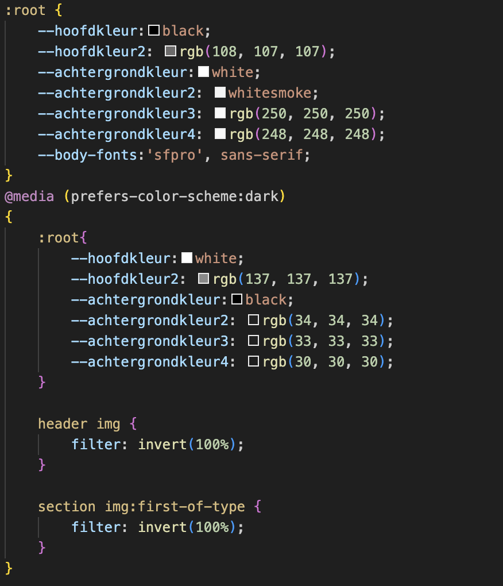

# Procesverslag
Markdown is een simpele manier om HTML te schrijven.  
Markdown cheat cheet: [Hulp bij het schrijven van Markdown](https://github.com/adam-p/markdown-here/wiki/Markdown-Cheatsheet).

Nb. De standaardstructuur en de spartaanse opmaak van de README.md zijn helemaal prima. Het gaat om de inhoud van je procesverslag. Besteedt de tijd voor pracht en praal aan je website.

Nb. Door *open* toe te voegen aan een *details* element kun je deze standaard open zetten. Fijn om dat steeds voor de relevante stuk(ken) te doen.

## Jij

  
uitwerken voor kick-off werkgroep

  ### Auteur:
  Mees van Wijngaarden

  #### Je startniveau:
  Rood

  #### Je focus:
  surface plane
 

## Je website

  
uitwerken voor kick-off werkgroep

  ### Je opdracht:
  link naar de website die je gaat namaken óf de naam/omschrijving van je eigen ontwerp  
  <a href="https://www.apple.com/nl/">apple.com</a>
  #### Screenshot(s) van de eerste pagina (small screen): 
  homepage  
  

  #### Screenshot(s) van de tweede pagina (small screen):
  hier de naam van de pagina   

  
 

## Toegankelijkheidstest 1/2 (week 1)

  
uitwerken na test in 2e werkgroep

  ### Bevindingen
  Lijst met je bevindingen die in de test naar voren kwamen:  
  
  

## Breakdownschets (week 1)

  
uitwerken na afloop 3e werkgroep

  ### de hele pagina: 
  

  ### dynamisch deel (bijv menu): 
  

## Voortgang 1 (week 2)

  
uitwerken voor 1e voortgang

  ### Stand van zaken
  hier dit ging goed & dit was lastig (neem ook screenshots op van delen van je website en code)

  ### Agenda voor meeting
  samen met je groepje opstellen

  | Silke                       | Bink               | Phon                          | Zoë                        | Mees    |
  | ---                         | ---                | ----                          | ---                        | ---     |
  |breakdownschets naar kijken  | divjes kijken      |GIF op site stil kunnen zetten | detailvraag/html css vraag |Font face|
  |                             |                    | ----                          |                            |         |
  | ...                         | ...                |  button in button             | ...                        |         |
  | ...                         | ...                |                               | ...                        |         |
 
  ### Verslag van meeting
  hier na afloop snel de uitkomsten van de meeting vastleggen

  - punt 1
  - punt 2
  - nog een punt
  - ...

## Voortgang 2 (week 3)

  
uitwerken voor 2e voortgang

  ### Stand van zaken
  hier dit ging goed & dit was lastig (neem ook screenshots op van delen van je website en code)

  ### Agenda voor meeting
  samen met je groepje opstellen

  | Silke                       | Phon                                          | Zoë                          | Mees                                                  |
  | ---                         | ----                                          | ---                          | ---                                                   |
  |                             |iets responsive maken, hoe?                    | button in het midden krijgen |twee a elementen naast elkaar alignen en centreren     |
  |                             |----                                           | ----                         | ----                                                  |
  | ...                         | moet in elke css de root aangesproken worden? |een verticale schuifbare lijst|Een gif rippen van apple en implementeren in eigen site|
  | ...                         |                                               | ...                          |                                                       |

  ### Verslag van meeting
  hier na afloop snel de uitkomsten van de meeting vastleggen

  - punt 1
  - punt 2
  - nog een punt
- ...

## Toegankelijkheidstest 2/2 (week 4)

  
uitwerken na test in 9e werkgroep

  
  
  
  
  

  ### Bevindingen
  Lijst met je bevindingen die in de test naar voren kwamen (geef ook aan wat er verbeterd is):
  Wat is er verbeterd? er is een dark thema toegevoegd, de code is semantisch correct geschreven, voor een screenreader is het goed te lezen en de kleurcontrasten kloppen ook, doordat er geen videos zijn speelt er ook niks automatisch op de achtergrond.

## Voortgang 3 (week 4)

  
uitwerken voor 3e voortgang

  ### Stand van zaken
  hier dit ging goed & dit was lastig (neem ook screenshots op van delen van je website en code)

  ### Agenda voor meeting
  samen met je groepje opstellen

| Phon                                                   | Zoë                          | Mees |
| ----                                                   | ---                          | ---  |
|hoe maak je een deel van een section een andere kleur?  | section in een section       |      |
|----                                                    | ----                         | ---- |
|Hoe maak je een section responsive/groeit mee met scherm|dropdownmenu en een schuifbalk|      |
|                                                        | ...                          |      |

  ### Verslag van meeting
  hier na afloop snel de uitkomsten van de meeting vastleggen

  - punt 1
  - punt 2
  - nog een punt
  - ...

## Eindgesprek (week 5)

  
uitwerken voor eindgesprek

  ### Je uitkomst - karakteristiek screenshots:
  

  ### Dit ging goed/Heb ik geleerd: 
  Ik heb geleerd hoe je een donker thema kan maken en hoe je gemakkelijk een pagina kan stylen zonder classes, divjes of id's

  

  ### Dit was lastig/Is niet gelukt:
  Het was niet gelukt om de icon van het hamburgermenu te laten transformeren tot een kruisje, om een of andere reden verpestte dat de rest van het menu

  

## Bronnenlijst

  
continu bijhouden terwijl je werkt

  Nb. Wees specifiek ('css-tricks' als bron is bijv. niet specifiek genoeg). 
  Nb. ChatGpT en andere AI horen er ook bij.
  Nb. Vermeld de bronnen ook in je code.

  1. [bron 1](https://www.w3schools.com/howto/howto_css_hide_scrollbars.asp )https://www.w3schools.com/howto/howto_css_hide_scrollbars.asp 
  2. bron 2
  3. ...

